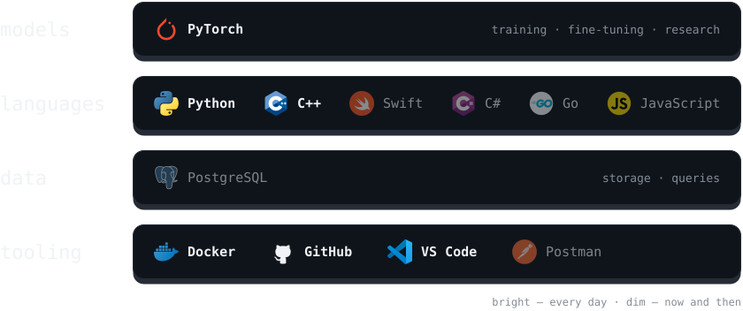
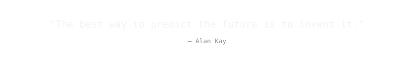

<picture>
  <source media="(prefers-color-scheme: dark)" srcset="./assets/header-dark.svg" />
  <source media="(prefers-color-scheme: light)" srcset="./assets/header-light.svg" />
  
</picture>

<a href="https://t.me/threex6dll9ff"><picture><source media="(prefers-color-scheme: dark)" srcset="./assets/contact-telegram-dark.svg" /><source media="(prefers-color-scheme: light)" srcset="./assets/contact-telegram-light.svg" /></picture></a><a href="https://www.linkedin.com/in/3x6dll9ff/"><picture><source media="(prefers-color-scheme: dark)" srcset="./assets/contact-linkedin-dark.svg" /><source media="(prefers-color-scheme: light)" srcset="./assets/contact-linkedin-light.svg" /></picture></a> <a href="https://x.com/3x6dll9ff"><picture><source media="(prefers-color-scheme: dark)" srcset="./assets/contact-x-dark.svg" /><source media="(prefers-color-scheme: light)" srcset="./assets/contact-x-light.svg" /></picture></a><a href="mailto:danila.kardashevskii@gmail.com"><picture><source media="(prefers-color-scheme: dark)" srcset="./assets/contact-email-dark.svg" /><source media="(prefers-color-scheme: light)" srcset="./assets/contact-email-light.svg" /></picture></a>

<picture>
  <source media="(prefers-color-scheme: dark)" srcset="./assets/title-about-dark.svg" />
  <source media="(prefers-color-scheme: light)" srcset="./assets/title-about-light.svg" />
  
</picture>

> I am a **Software Engineer** with **4+ years of experience** specializing in **Machine Learning Engineering**.
>
> Leveraging my background in **Electrical Engineering & CS**, I apply production-grade engineering practices to **Machine Learning** to build robust and scalable AI systems.
>
> - **Current Focus:** Machine Learning Engineering, Deep Learning, MLOps.
> - **Mission:** To build intelligent technologies that make a tangible impact.
> - **Connect:** Always open to discussing interesting AI/ML challenges and opportunities.

<picture>
  <source media="(prefers-color-scheme: dark)" srcset="./assets/title-stack-dark.svg" />
  <source media="(prefers-color-scheme: light)" srcset="./assets/title-stack-light.svg" />
  
</picture>

<picture>
  <source media="(prefers-color-scheme: dark)" srcset="./assets/stack-dark.svg" />
  <source media="(prefers-color-scheme: light)" srcset="./assets/stack-light.svg" />
  
</picture>

<picture>
  <source media="(prefers-color-scheme: dark)" srcset="./assets/title-activity-dark.svg" />
  <source media="(prefers-color-scheme: light)" srcset="./assets/title-activity-light.svg" />
  
</picture>

<picture>
  <source media="(prefers-color-scheme: dark)" srcset="https://raw.githubusercontent.com/3x6dll9ff/3x6dll9ff/output/metrics-dark.svg" />
  <source media="(prefers-color-scheme: light)" srcset="https://raw.githubusercontent.com/3x6dll9ff/3x6dll9ff/output/metrics-light.svg" />
  
</picture>

<picture>
  <source media="(prefers-color-scheme: dark)" srcset="https://raw.githubusercontent.com/3x6dll9ff/3x6dll9ff/output/github-contribution-grid-snake-dark.svg" />
  <source media="(prefers-color-scheme: light)" srcset="https://raw.githubusercontent.com/3x6dll9ff/3x6dll9ff/output/github-contribution-grid-snake.svg" />
  
</picture>

<picture>
  <source media="(prefers-color-scheme: dark)" srcset="./assets/quote-dark.svg" />
  <source media="(prefers-color-scheme: light)" srcset="./assets/quote-light.svg" />
  
</picture>

  

